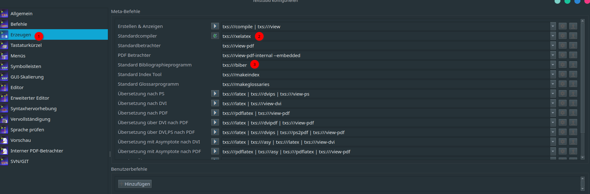

# IIOT-Project
This repository holds all work from the IIOT-Grop 4 in WS2023/24 for CCCE-Master.\
The master branch is protected and maintained by Robin Dietzel `robin.dietzel@iem.thm.de`.


## Directory hierarchy
|Directory|Description|
|-------------------------|-----------------------------------|
|**demos/libmodbus-demo**|Demo code using C language and libmodbus|
|**demos/pymodbus-demo**|Demo code using python language and pymodbus|
|**hardware**|Code and tools for deploying hardware in this project|
|**reports**|Report history of meetings and team decisions written in markdown|
|**report**|LaTeX tree for final report of the project|
|**report/assets**|Graphical assets for the report|
|**report/chapters**|Partial LaTeX files containing chapters (one file per section)|
|**report/tex**|Pramble with document layout and acronyms|
|**report/IIOT-Report.tex**|Main report|
|**report/sources.bib**|BibLaTeX database for all used sources|


## Portainer server
[Link to Portainer](https://mt-labor.iem.thm.de:9443)

**Very important:** Do not edit the public stacks from team 1 !

### Port ranges
|External port|Internal port|Service|
|-------------|-------------|-------|
|**20000**|6052|[Esphome](http://mt-labor.iem.thm.de:20000)|
|**20001**|1880|[Node-Red](http://mt-labor.iem.thm.de:20001)|
|**20002**|8086|[Influxdb2](http://mt-labor.iem.thm.de:20002)|
|**20003**|3000|[Grafana](http://mt-labor.iem.thm.de:20003)|
|**20004**|18083|[Emqx web](http://mt-labor.iem.thm.de:20004)|
|**20005**|1883|Emqx mqtt|
|**20006**|8883|Emqx ssl|

### Login credentials
General Username: `admin`\
General Password: `iotlab2023team4`\
Influxdb2 token: `HUUXF8DweGahdKvIv0g3hCM0YPILqgseM3DTDuRnFY2Cl7HEhEDC8iEcvb4o4WZqbc4-EqVoEJ8BPURG6yatVQ==`\
Influxdb2 org: `iot-team4`\
Influxdb2 bucket: `iot-data`

# Git/LaTeX basics
This section is used to describe some basic and useful commands/tools for using git on your local compouter and for building the documentation in LaTeX.


## Git
Download link for git: https://git-scm.com/download/win

#### Setup ssh keys
For being able to clone the repository onto your local computer, you must at first setup a public/private key in your [thm gitlab account](https://git.thm.de). Therefor you must start `git bash` from your start menu.\
Then you run in this terminal the command to generate a new key:
```bash
ssh-keygen -t rsa -b 4096 -C "your_email@iem.thm.de"
```
Then you are asked where to store the file. Just leave in the default and press enter **Important:** Note down the path where the key is stored. Then you're asked for a password. Just enter nothing and press enter again (twice).
Next step will be to start the ssh-agent and then import this newly created key. Therefor run:
```bash
eval "$(ssh-agent -s)"
ssh-add your-noted-path/id_rsa
```
After you completed those steps, the ssh key is installed properly. In the directory the key is stored (the `id_rsa` is in) there also must be a file called `id_rsa.pub`. Open this file with a text editor and copy it's contents to your clipboard. Then go to your [gitlab profile's preferences and click on SSH-keys](https://git.thm.de/-/profile/keys). There you can paste your key and finally click onto **Add key**.

#### Clone the repository
For cloning the repo to a local directory, go to the directory in windows explorer, then right click and click onto `open git bash here`. Then type the clone command:
```bash
git clone git@git.thm.de:rtdt35/iiot-project.git
```
Than at first you should set the default pull behavior with the following commands:
```bash
cd iiot-project
git config pull.rebase true
```

#### Working with the repository
Now you are ready to work with the repository. A normal git workflow consists of the following steps:
1. Clone the repo (already done)
2. Create a custom working branch for you
3. Checkout the working branch (switch to that branch)
4. Do your work
    1. Edit the files within the repo or add files
    2. Commit the changes in the file (each commit has a small commit message that says what was done in this commit)
    3. Push your changes to the thm git server
5. Repository supervisor (Robin Dietzel) will merge your branches into the master after you completed your subtask

##### Create a custom branch {#cb}
```bash
git branch rtdt35-test1 # Creates a branch called 'rtdt35-test1' - Its good practice to prepend the branch name with your thm username
git branch # List all available branches
git checkout rtdt35-test1 # Checkout this branch. All work is now commited on this branch
git branch # Again lists all available branches. Your branch should be highlighted now instead of master
```

##### Commit your work
Now you do your work. All small steps are captured by commits. E.g. after each paragraph you wrote in the report you do a commit.\
After you done such changes (like you have written a paragraph) then you commit your work:
```bash
git status #  Shows files you have changed or newly added
git add file1.txt file2.tex file3.py # Add all listed files listed by the status command you want to track changes in this commit for
git commit -m "Type your commit message here" # Commits the changes and makes them permanent
git push --set-upstream origin rtdt35-test1 # Sets where to push the changes. This must be done only once for each newly created branch.
git push # This command is simply enough if your branch was already pushed once by the preceeding command
```
Now your changes should be visible in the remote repository at https://git.thm.de. Remember to pick your branch if you click on the small dropdown next to `master` to see your changes. If you click on `Commits` you can browse a history of all your commits and which changes were made.\
Keep in mind that usually only text-like files, sometimes graphic files are added to git only because in binary files (e.g. Word Documents) the changes could not be tracked. So think twice before adding and commiting large binary files!

##### Update master {#um}
If you want to update the master branch before creating a branch from latest master revision, just run the following commands:
```bash
git checkout master # Switch back to master branch. make sure you have no untracked changes before
git pull --rebase # Pull the latest master
```
Then you can create a new branch for a new subtask. This is explained [here](#cb).

##### Discard changes since last commit
You can use git to easily discard all changes since the last commit you've done. This might be especially useful when you want to checkout another branch and delete your changes you had not commited yet. If you enter the checkout command in this scenario, then you will receive an error: _error: Your local changes to the following files would be overwritten by checkout_.
```bash
git reset --hard HEAD
```
After that you should be able to switch to your other branch.

### Important Notes
- Never commit changes on the `master` branch
- Don't forget to push
- Commit regularly
- Explain in your commit messages what you've done (pls. don't write only placeholder texts!)
- Checkout master and [pull](#um) before you create a new branch to have the latest base you add your work on top!

## LaTeX Hints
This section covers some basic tools hints and settings to setup a local LaTeX dev environment to compile
the report for this IIOT project.
#### Necessary tools
These tools are necessary to build the report using LaTeX. Just install them using their installers. On the
downoad page from MikTeX you can find a link to an installation tutorial. But in general it's really straight-forward.\
For linux users: just install the `texlive-full` package from your distribution to have full TeX support. The TexStudio is
usually also available via your distribution package manager.
- https://miktex.org/
- https://www.texstudio.org/

#### Configuration of TexStudio for the project

Check if your TexStudio settings are set correctly to use `xelatex` and `biber`.\
The important entries are marked in the screenshot.\
After setting these options, you should be able to open the `.tex` file as a project and build the report as pdf!
